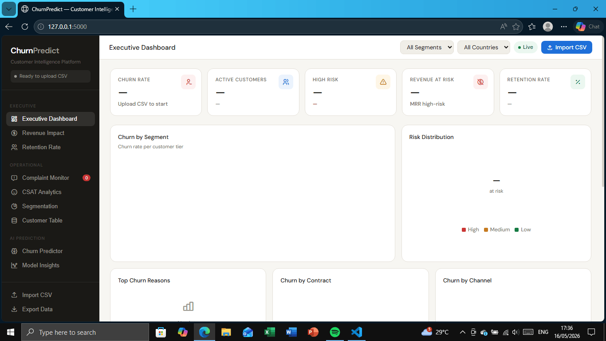
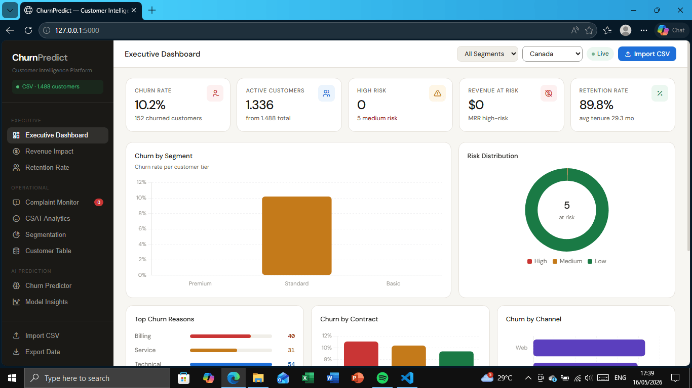
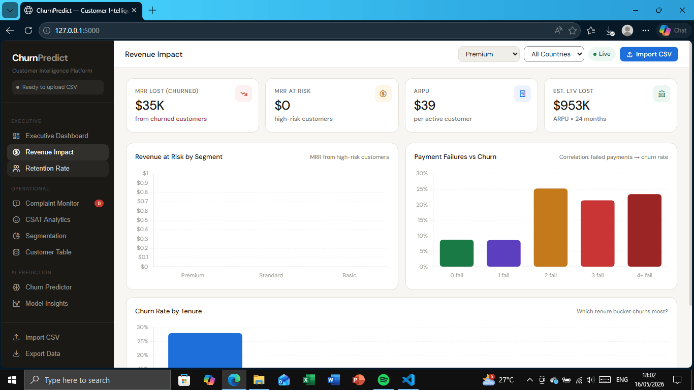
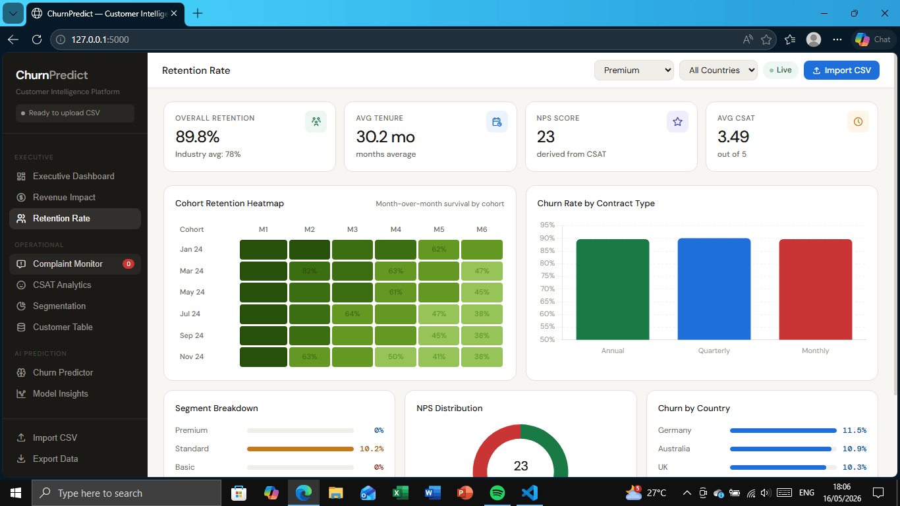
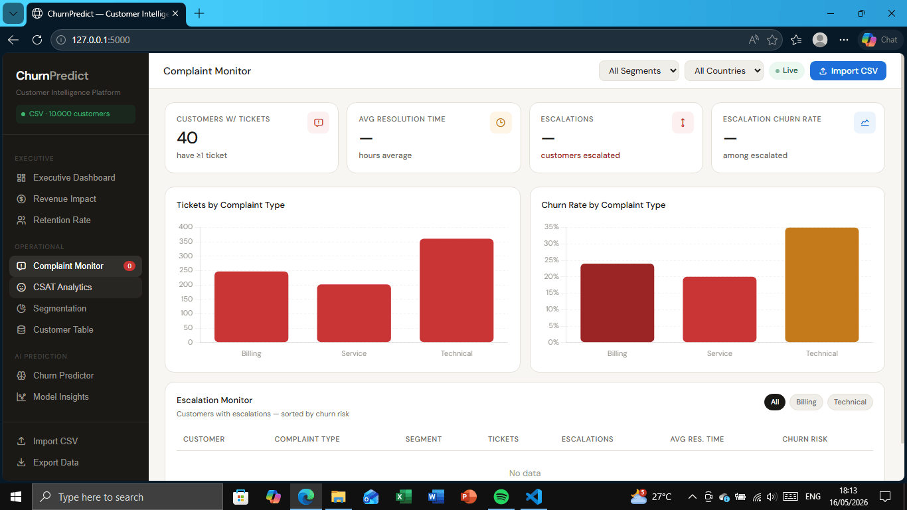
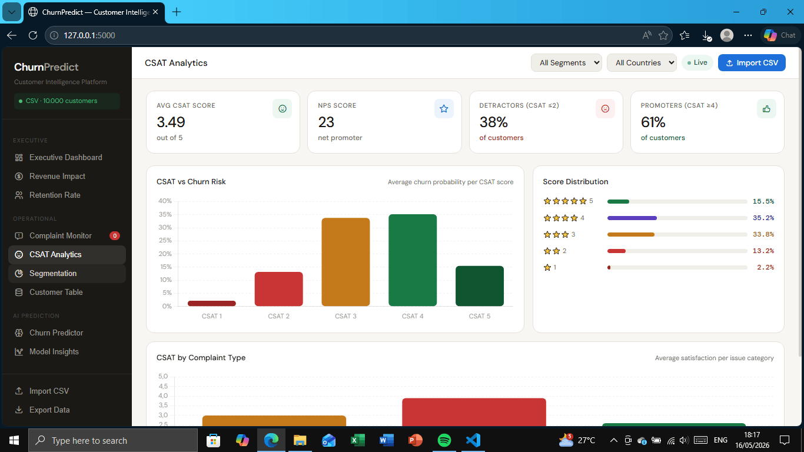
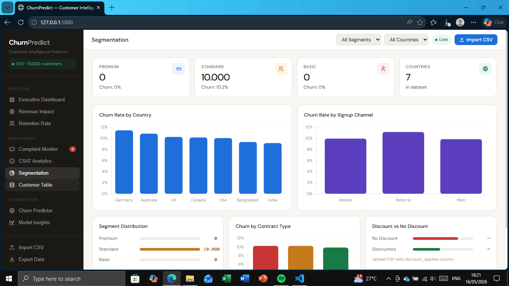
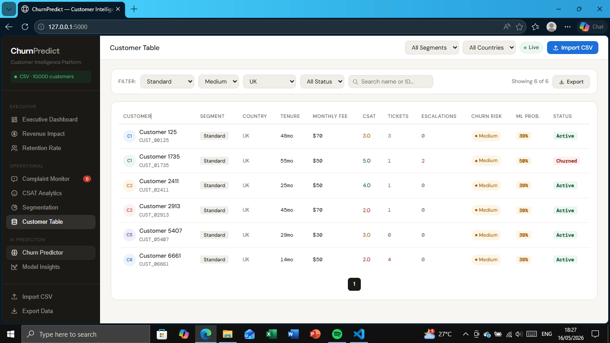
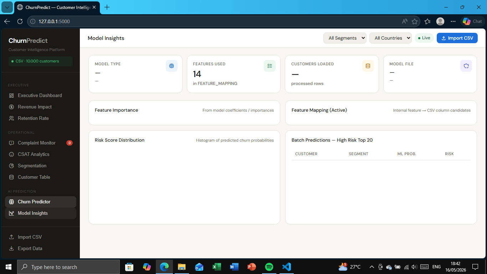

# Churn & Customers Predict Analyst Web Base

## Overview
This project develops a customer churn prediction dashboard that integrates exploratory data analysis with machine learning capabilities to predict the likelihood of a customer discontinuing their subscription. The system accepts customer data input in CSV format, processes it using a classification algorithm, and displays the results through various interactive visualizations, including churn trend charts, risk distribution by segmentation, and a list of high-risk customers. Featuring an intuitive and responsive user interface, this dashboard empowers business teams and data analysts to monitor customer health effectively, identify churn patterns, and design more targeted, data-driven retention strategies
## Import & Executive Dashboard Feature

The Data Import feature allows users to upload CSV files including datasets from Kaggle, which are then displayed in the Executive Dashboard as real and dynamic charts according to the original imported data. The dashboard presents KPIs such as Churn Rate, active customers, high risk, and average CSAT in the form of metric cards, bar charts, donut diagrams, as well as lists of churn reasons. However, the dashboard currently cannot import datasets with cases that differnt from the predefined column structure.

## Revenue Impact Feature

The Revenue Impact feature measures the financial impact of customer churn by displaying key metrics such as MRR Lost (lost revenue), MRR at Risk (revenue threatened from high-risk customers), and ARPU (average revenue per user). This feature also presents monthly revenue trend graphs and risk revenue charts by segmentation, helping management prioritize retention efforts on the most valuable customer segments and minimize revenue loss due to churn.

## Retention Rate Feature

The Retention Rate feature measures overall customer retention by displaying Overall Retention Rate and Average Tenure metrics. It also presents retention trend graphs by contract type and an NPS Trend chart showing Net Promoter Score movements over time, helping management evaluate retention strategies and identify contract types with the highest retention rates to improve customer loyalty

## Complaint Monitor Feature

The Complaint Monitoring feature tracks customer complaints as early churn indicators by displaying Open Tickets and Average Resolution Time metrics. It presents ticket distribution by complaint type and volume by customer segment, along with an Escalation Monitor that lists customers with the highest ticket counts and their churn risk levels, enabling customer service teams to prioritize critical cases, respond faster, and prevent churn caused by poor service experiences.

## CSAT Analytics Feature

The CSAT Analytics feature measures customer satisfaction by displaying Average CSAT Score and NPS Score metrics. It presents a CSAT vs Churn Risk chart showing the relationship between satisfaction levels and churn risk, along with an NPS Distribution donut chart categorizing customers into Promoters, Passives, and Detractors. This enables companies to identify dissatisfied customers before they churn and design targeted strategies to improve satisfaction and convert Detractors into Promoters.

## Segmentation Feature

The Segmentation feature analyzes customer data across different categories to identify churn patterns within specific groups. It displays Churn Rate by Country in a bar chart comparing churn rates across regions, along with Segment Distribution showing customer counts and churn rates for Premium, Standard, and Basic segments using horizontal bar charts. Equipped with KPI Cards displaying segment-specific metrics like total customers, churn count, and average CSAT per segment, this feature helps companies allocate retention resources more efficiently by focusing efforts on segments or regions with the highest churn rates.

## Customer Table Feature

The Customer Table feature displays all customer data in an interactive table format showing Name, Customer ID, Segmentation, Tenure, Monthly Fee, Churn Risk Level (High/Medium/Low), and Status (Churned/Active). Equipped with filters by Segmentation and Risk Level, a search bar for finding specific customers, pagination for easy navigation, and an Export button to download data as CSV, this feature enables users to perform granular data exploration, validate prediction results, and identify individual high-risk customers for follow-up action.

## Churn Predictor Feature

The Churn Predictor feature uses an XGBoost Machine Learning model with 84% accuracy to predict customer churn likelihood. It offers two modes: Single Customer Predictor for manual data entry through a form (Segment, Tenure, Monthly Fee, Support Tickets, Days Since Login, CSAT Score, Payment Failures), displaying results as a churn probability percentage and risk level (High/Medium/Low) in color-coded cards; and Batch Predictions displaying all customers with ML Score, risk level, and recommended actions (Call now / Send offer / Monitor). With 86% accuracy, this feature enables business teams to make confident, data-driven retention decisions and intervene early with customers identified as churn risks.

## Model Insight Feature

